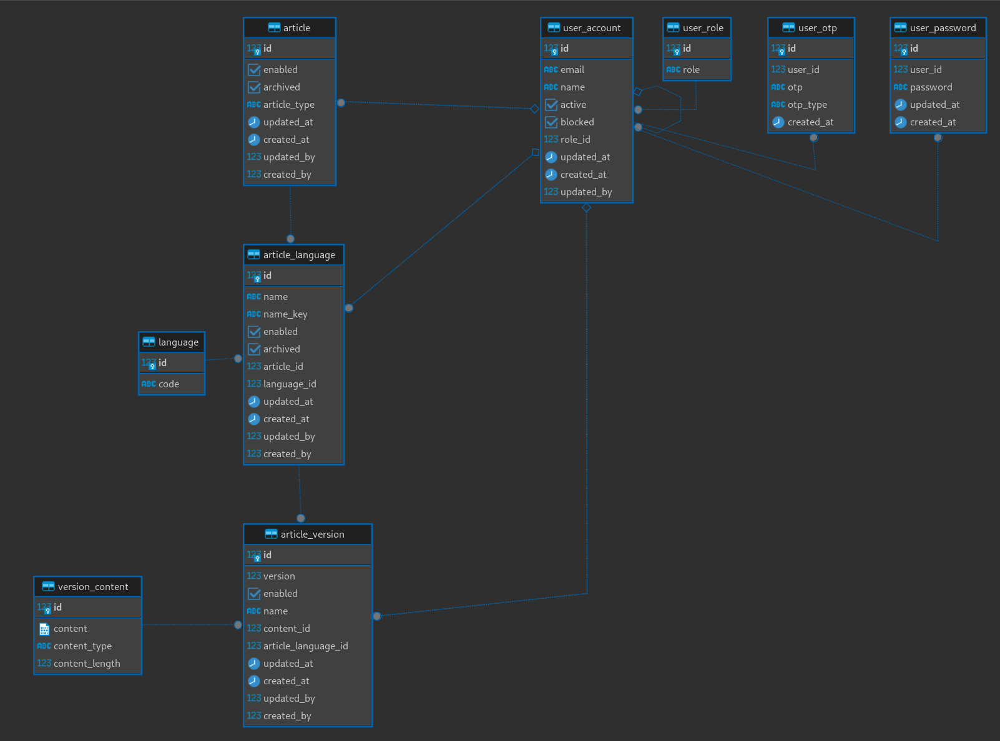

# wiki_engine

[](https://github.com/petrenkoVitaliy/wiki_engine/actions)

<b>Wiki_engine</b> is a Rust-based application designed to serve as a flexible wiki engine. It offers comprehensive features for managing articles, including creation, reading, updating, and deletion. The system implements version control for articles/versions, user authentication, and authorization.

Additionally, it seamlessly integrates with external services such as a mail provider for user sign-up and password reset functionalities, as well as Google Cloud for image storage. The core of the application is built on the Rocket framework, and it connects to a PostgreSQL database for robust and scalable data storage.

**Table of Contents:**

- [Installation](#installation)
  - [Prerequisites](#prerequisites)
  - [Setup](#setup)
- [Entities](#entities)
  - [DB Schema](#db-schema)
- [Structure](#structure)
- [Swagger](#swagger)
- [Testing](#testing)

## Installation

### Prerequisites

- Rust: [Install Rust](https://www.rust-lang.org/tools/install)
- Docker: [Install Docker](https://docs.docker.com/get-docker/)
- Diesel CLI: [Install Diesel CLI](https://diesel.rs/guides/getting-started)
- cargo-llvm-cov (optionally - for tests' coverage): [Git -> cargo-llvm-cov ](https://github.com/taiki-e/cargo-llvm-cov)
- cargo-watch (optionally): [crates.io -> cargo-watch](https://crates.io/crates/cargo-watch)

### Setup

There are bash scripts to use:

- [launch_postgres.sh](scripts/launch_postgres.sh)
  builds and runs PG docker container (with default configs)
- [reroll_postgres.sh](scripts/reroll_postgres.sh)
  drops all PG schemas and runs migrations
- [run_migrations.sh](scripts/run_migrations.sh)
  runs migrations with diesel cli (for `main` schema)
- [watch.sh](scripts/watch.sh)
  starts server in `watch` mode (with [cargo-watch](https://crates.io/crates/cargo-watch))
- [test.sh](scripts/test.sh)
  runs tests

  - possible options:
    - [-f] -> flushes DB
    - [-c] -> runs in coverage mode (& generates report)

#### So, to launch server:

0. Can be launched with [Dockerfile](Dockerfile)

1. Launch DB (skip if remote):
   ```sh
   sh scripts/launch_postgres.sh
   sh scripts/run_migrations.sh
   ```
2. Configure .env file according to [example](.env.example)
3. Launch server

   ```sh
   sh scripts/watch.sh
   ```

   ```sh
   >>> 🚀 Rocket has launched from http://0.0.0.0:8000
   ```

## Entities

- Main "central" entity is `article`
- `article` can contain multiple `article_language`s (at least one)
  - -> connects article's content with `language`
- `language`
- `article_version`
  - -> article language's versions
- `version_content`

  - -> article versions's content
  - can be in one of two formats:
    - [according to field `content_type` => ENUM ('full', 'diff')]:
      - `full` => raw json format (for last - actual version)
      - `diff` => (bytea format) bytes difference between current version and next one (all article versions, except actual one)

- And users' records - `user_account`, with: `user_role`, `user_password`, `user_otp`

### DB schema

<p align="center">
  
</p>

## Structure

1. `/router`

2. `/service` => entities flow logic
3. `/repository` => DB interface

   3.1. `/entity` => DB table model + service

   3.2. `/db_schema` => full db schema description

4. `/aggregation` => response aggregation models
   </br>
   </br>

- `/test`
- `/authorization` => auth flows (JWT generation, validation, roles&permissions validation)
- `/diff_handler` => module to handle difference bw strings (delta, patch)
- `/dtm` => request models (dtos, bodies)
- `/dtm_common` => inner dtm models (jwt, user_role...)
- `/emailer` => send emails templates
- `/error` => formatted error module
- `/hasher` => argon (pwd) hasher
- `/jwt_handler`

## Swagger

UI -> http://0.0.0.0:8000/swagger

via [rocket_okapi](https://crates.io/crates/rocket_okapi)

## Testing

`/tests/entities` contains tests for each entity & flow separately.

Each test uses `TestSetup` module to bypass single `Client` instance and DB connection mutex.
